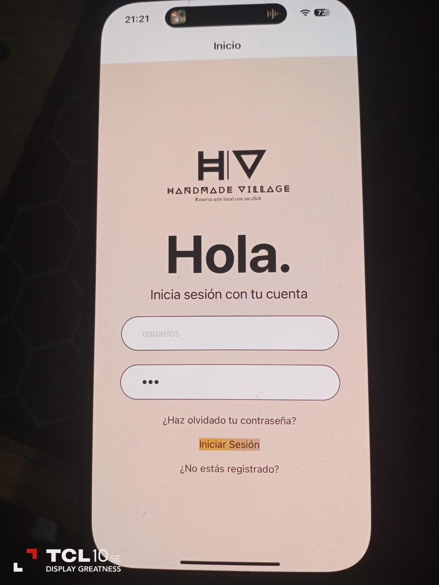
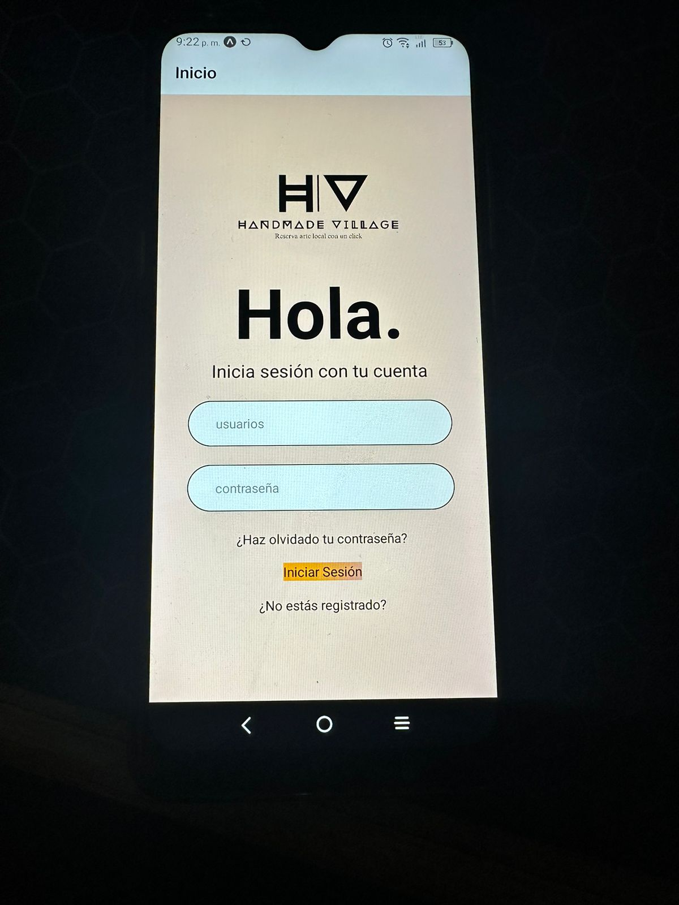

<!-- Improved compatibility of back to top link: See: https://github.com/othneildrew/Best-README-Template/pull/73 -->

<!--
*** Thanks for checking out the Best-README-Template. If you have a suggestion
*** that would make this better, please fork the repo and create a pull request
*** or simply open an issue with the tag "enhancement".
*** Don't forget to give the project a star!
*** Thanks again! Now go create something AMAZING! :D
-->

<!-- PROJECT SHIELDS -->
<!--
*** I'm using markdown "reference style" links for readability.
*** Reference links are enclosed in brackets [ ] instead of parentheses ( ).
*** See the bottom of this document for the declaration of the reference variables
*** for contributors-url, forks-url, etc. This is an optional, concise syntax you may use.
*** https://www.markdownguide.org/basic-syntax/#reference-style-links
-->

[![LinkedIn][linkedin-shield]][linkedin-url]

<!-- PROJECT LOGO -->
 

  

  <h3 align="center">HandMade Village</h3>

  

HACK THE FUTURE
 
    José Daniel Man Castellanos
  

<h1>Handmade Village</h1>

En un pueblo donde se desarrollan artesanías y a su vez es visitada por turistas, la población local necesita una aplicación móvil donde puedan colocar sus productos y a través de la misma app los turistas puedan realizar sus reservas de productos (No pago en línea) para impulsar la economía local de dicha comunidad.

<h1>Mi experiencia en Hack The Future</h1>

Tuve una experiencia increíblemente gratificante con el reto. Fue la primera vez que trabajé con REACT NATIVE y, aunque no pude completarlo en su totalidad, logré avanzar significativamente gracias al apoyo y los recursos que me brindaron. Me encantaría continuar trabajando con el equipo de Eagle Hubs, ya que ha sido una de las mejores experiencias que he tenido. Agradezco mucho por la oportunidad que me brindaron y por el tiempo y el esfuerzo que invirtieron en mí. ¡Gracias de nuevo!

Tecnologías usadas: 
- ReactNative
- Expo Go
<!-- ABOUT THE PROJECT -->
## Acerca de mi portafolio

Soy José Daniel Man Castellanos, tengo 21 años y soy desarrollador web fullstack, comencé mi crecimiento como desarrollador web desde los 14 años realizando diversos
Cursos. Tengo 4 años de experiencia laboral trabajando para diversad entidades como upwork, Universidad Rafael Landívar y haricode (empresa propia de desarollo web). Tengo experiencia en las siguientes tecnologías: 

* PHP, Laravel, Symphony, MVC 
* JavaScript, jQuery, Node.js, Angular, APIS REST
* Mysql, SqlServer
* Manejo de cpanel, siteground
* Html
* Css, Bootstrap, Sass, Css grid
* Google Cloud, Lampstack, google analytics, google maps, google contacts
* SEO, Url-amigables, optimización de recursos
* Github, Github actions, git, modelos de implementación (trunk-base y gitflow)
* Maquetación, adobe XD, figma
* Wordpress, plugins, elementor, desarrollo de temas personalizados
* c#, modelo MVC

<!-- CONTACT -->
## Hablemos!

Your Name - José Man - <a href="mailto:jmancaste@gmail.com">jmancaste@gmail.com</a>

Link de proyecto: [https://github.com/JoseMan200124/portfolio-4.0](https://github.com/JoseMan200124/portfolio-4.0)

(<a href="#readme-top">back to top</a>)

<!-- MARKDOWN LINKS & IMAGES -->
<!-- https://www.markdownguide.org/basic-syntax/#reference-style-links -->
[contributors-shield]: https://img.shields.io/github/contributors/othneildrew/Best-README-Template.svg?style=for-the-badge
[contributors-url]: https://github.com/othneildrew/Best-README-Template/graphs/contributors
[forks-shield]: https://img.shields.io/github/forks/othneildrew/Best-README-Template.svg?style=for-the-badge
[forks-url]: https://github.com/othneildrew/Best-README-Template/network/members
[stars-shield]: https://img.shields.io/github/stars/othneildrew/Best-README-Template.svg?style=for-the-badge
[stars-url]: https://github.com/othneildrew/Best-README-Template/stargazers
[issues-shield]: https://img.shields.io/github/issues/othneildrew/Best-README-Template.svg?style=for-the-badge
[issues-url]: https://github.com/othneildrew/Best-README-Template/issues
[license-shield]: https://img.shields.io/github/license/othneildrew/Best-README-Template.svg?style=for-the-badge
[license-url]: https://github.com/othneildrew/Best-README-Template/blob/master/LICENSE.txt
[linkedin-shield]: https://img.shields.io/badge/-LinkedIn-black.svg?style=for-the-badge&logo=linkedin&colorB=555
[linkedin-url]: https://www.linkedin.com/in/josé-daniel-man-castellanos-fullstackwebdeveloper/
[product-screenshot]: images/screenshot.png
[Next.js]: https://img.shields.io/badge/next.js-000000?style=for-the-badge&logo=nextdotjs&logoColor=white
[Next-url]: https://nextjs.org/
[React.js]: https://img.shields.io/badge/React-20232A?style=for-the-badge&logo=react&logoColor=61DAFB
[React-url]: https://reactjs.org/
[Vue.js]: https://img.shields.io/badge/Vue.js-35495E?style=for-the-badge&logo=vuedotjs&logoColor=4FC08D
[Vue-url]: https://vuejs.org/
[Angular.io]: https://img.shields.io/badge/Angular-DD0031?style=for-the-badge&logo=angular&logoColor=white
[Angular-url]: https://angular.io/
[Svelte.dev]: https://img.shields.io/badge/Svelte-4A4A55?style=for-the-badge&logo=svelte&logoColor=FF3E00
[Svelte-url]: https://svelte.dev/
[Laravel.com]: https://img.shields.io/badge/Laravel-FF2D20?style=for-the-badge&logo=laravel&logoColor=white
[Laravel-url]: https://laravel.com
[Bootstrap.com]: https://img.shields.io/badge/Bootstrap-563D7C?style=for-the-badge&logo=bootstrap&logoColor=white
[Bootstrap-url]: https://getbootstrap.com
[JQuery.com]: https://img.shields.io/badge/jQuery-0769AD?style=for-the-badge&logo=jquery&logoColor=white
[JQuery-url]: https://jquery.com 
